Hey! I'm Kawsar Kabir, a passionate and self-motivated Jr. Full-Stack Developer with over 3 years of hands-on learning experience in web development. I specialize in the MERN stack (MongoDB, Express, React, Node.js) along with JavaScript and TypeScript. What drives me is my intellectual curiosity and deep enthusiasm for problem-solving - I love building scalable, user-friendly web applications that make a real difference. My ultimate dream? To become a skilled Software Engineer and eventually launch my own IT startup that creates impactful tech products for businesses and communities. Right now, I'm actively seeking opportunities where I can grow, contribute, and collaborate in challenging and rewarding environments.

## :eyes: Current overview

#### 🥅 Comfort Zone - Typescript, Javascript, React, Redux, Nextjs, ShadcnUI, Tailwind, Node, Express, Mongoose

#### 💼 Developing [DEV ZeroOne](https://github.com/kawsarkabir/devzeroone-client) — a MERN-based full-stack website.

#### 🧣 Currently learning deep dive into advanced backend.

#### 📝 I'm writing technical blogs on [Medium](https://medium.com/@kawsarkabir)

#### 🤝 I’m looking to collaborate on open-source projects.

#### 💤 Fun fact - My beautiful gf left me because whole day I do code :)

## :mailbox: Reach me out

 

**_
  
_**

 

## :computer: Technologies that I know

<table align="center">
  <tr>
    <td align="center" width="96">
        
       TypeScript
    </td>
     <td align="center" width="96">
        
       JavaScript
    </td>
    <td align="center" width="96">
        
       Mongoose
    </td>
    <td align="center" width="96">
        
       Node JS
    </td>
    <td align="center" width="96">
      
       Rest API
    </td>
    <td align="center" width="96">
        
       Next.js
    </td>
     <td align="center" width="96">
        
       PostgreSQL
    </td>
    <td align="center" width="96">
        
       Express 
    </td>
   <td align="center" width="96">
        
       shadcn/ui
   </td>
  </tr>
  <tr>
   <td align="center" width="96">
        
       React
    </td>
   <td align="center" width="96">
        
       Redux
    </td>
    <td align="center" width="96">
        
       Firebase
    </td>
    <td align="center" width="96">
        
       Figma
    </td>
    <td align="center" width="96">
        
       Tailwind
    </td>
      <td align="center" width="96">
        
       Bootstrap
    </td>
    <td align="center" width="96">
        
       Sass
    </td>
    <td align="center" width="96">
        
       CSS3
    </td>
    <td align="center" width="96">
        
       HTML5
    </td>
  </tr>
</table>

## :chart_with_upwards_trend: Current Stats

 

  
 
  

  

  

## :book: My recent blog posts

<!-- blog start here  -->

- [What Are Value & Reference in JavaScript?](https://medium.com/@kawsarkabir/what-are-value-reference-in-programming-f16cce742e31)
- [Understanding JavaScript Execution Context: Call Stack, Heap Memory](https://medium.com/@kawsarkabir/understanding-javascript-execution-context-call-stack-heap-memory-and-visualizing-code-execution-dfc3ab0a2f4f)
- [Hoisting এটা আবার কি? | Hoisting in JavaScript](https://medium.com/@kawsarkabir/hoisting-%E0%A6%8F%E0%A6%9F%E0%A6%BE-%E0%A6%86%E0%A6%AC%E0%A6%BE%E0%A6%B0-%E0%A6%95%E0%A6%BF-understanding-javascript-hoisting-70afcbc4bbb6)
- [What is React and How it works ?](https://medium.com/@kawsarkabir/what-is-react-and-how-it-works-9b799bceba0f)
- [React-এর Virtual DOM, Reconciliation Algorithm, real DOM vs Virtual DOM](https://medium.com/@kawsarkabir/react-%E0%A6%8F%E0%A6%B0-virtual-dom-concept-reconciliation-algorithm-benefits-of-using-it-and-comparison-with-05929f9a9545)
