## :eyes: Current overview

#### 🥅 Goals of 2024 - Typescript, Express, Mongoose, Redux, Nextjs, RDMS, Prisma and PostgreSQL, Docker, AWS

 

#### 🧣 I'm currently - Learning Deep Dive into Express and Mongoose

#### 🌱 In my free time, I’m exploring - UX Design

#### 🤔 I’m trying - To help people learn web development

#### 🤝 I’m looking - To collaborate on open-source projects

#### 💤 Fun fact - My beautiful GF left me because whole day I do code :-D

## :chart_with_upwards_trend: Current Stats

 

  

## :mailbox: Reach me out

 

**_
  
_**

 

## :computer: Technologies that I know

<table align="center">
  <tr>
    <td align="center" width="96">
        
       TypeScript
    </td>
     <td align="center" width="96">
        
       JavaScript
    </td>
    <td align="center" width="96">
        
       Mongoose
    </td>
    <td align="center" width="96">
        
       Node JS
    </td>
    <td align="center" width="96">
      
       Rest API
    </td>
    <td align="center" width="96">
        
       Next.js
    </td>
     <td align="center" width="96">
        
       PostgreSQL
    </td>
    <td align="center" width="96">
        
       Express 
    </td>
   <td align="center" width="96">
        
       shadcn/ui
   </td>
  </tr>
  <tr>
   <td align="center" width="96">
        
       React
    </td>
   <td align="center" width="96">
        
       Redux
    </td>
    <td align="center" width="96">
        
       Firebase
    </td>
    <td align="center" width="96">
        
       Figma
    </td>
    <td align="center" width="96">
        
       Tailwind
    </td>
      <td align="center" width="96">
        
       Bootstrap
    </td>
    <td align="center" width="96">
        
       Sass
    </td>
    <td align="center" width="96">
        
       CSS3
    </td>
    <td align="center" width="96">
        
       HTML5
    </td>
  </tr>
</table>
